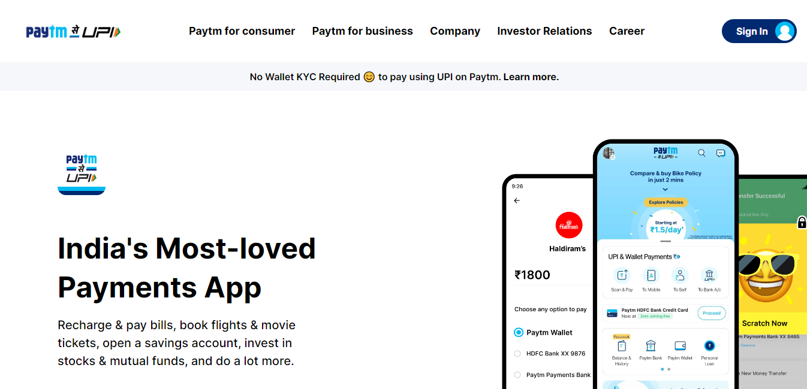

# PAYTM Clone

##  Created by : [Gaurav Kumar](https://the-gaurav-portfolio.netlify.app/)

 

***

### Tech I Used
 

***

## My Key Learnings from this project

 

### In this project, I build Paytm Clone

- I Learned, how to define, custom screen size and color in tailwind css.

- I learned, how to make website responsive using tailwind css.

- I learned, about hover effect on buttons.

- I learned, how to use flexbox in tailwind css. 

***

### Checkout the webiste : [Click Here](#)

***
 

### How the PAYTM Clone is looking

 

### Website View

 

### Mobile View

 

### Lablet View

